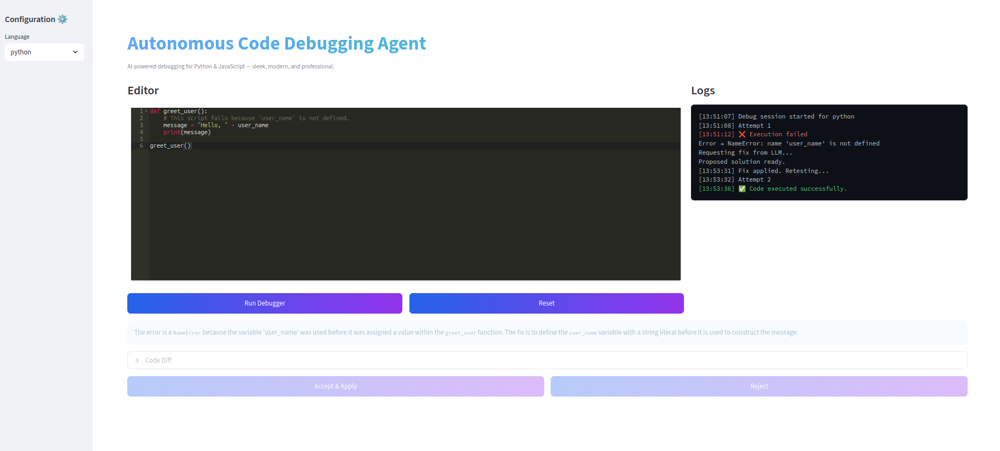
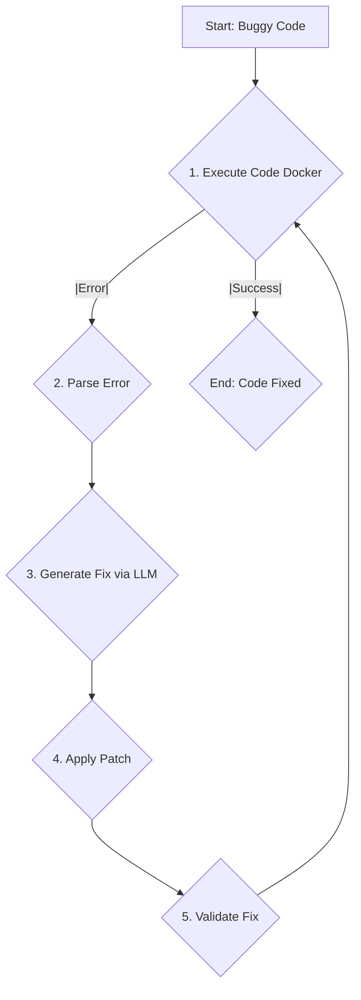

[](https://opensource.org/licenses/MIT)
[](https://www.python.org/downloads/)
[](https://streamlit.io/)
[](https://www.docker.com/)


---

# Autonomous Code Debugging Agent (ACDA)

ACDA is an interactive web application that uses the power of Large Language Models (LLMs) to autonomously diagnose and fix bugs in your code. Simply select a language, provide your buggy code, and let the agent work its magic.

 

---

## Features

*   **Multi-Language Support:** Debugs both **Python** and **JavaScript** code.
*   **Interactive Web Interface:** A user-friendly frontend built with [Streamlit](https://streamlit.io/) provides a seamless experience.
*   **LLM-Powered Diagnostics:** Leverages an LLM to understand error messages and propose intelligent solutions.
*   **Sandboxed Execution:** Code is safely executed within a Docker container to prevent unintended side effects.
*   **Interactive Diff View:** Clearly review the agent's proposed changes with a side-by-side comparison of the original and fixed code.
*   **User-Controlled Workflow:** You have the final say. Accept the agent's proposed fix to continue the debugging process, or reject it and stop.
*   **Visual Feedback:** A loading spinner and real-time logs keep you informed of the agent's progress.

---

##  System Architecture

Each module in ACDA performs a clearly defined role to ensure reliability, interpretability, and safety.

**Secure Executor**

- Executes user code inside a sandboxed Docker container with full isolation from the host system.

- Supports both Python and JavaScript runtimes.

- Captures all execution logs, including `stdout`, `stderr`, and `return` codes.

- Guarantees safe experimentation and prevents malicious code execution.

--- 
**Error Parser**

- Interprets the code’s `stderr` output using regex and rule-based logic.

- Extracts structured details such as:

    - Error Type (e.g., `NameError`, `ReferenceError`)

    - Message

    - Line Number (if available)`

- Produces structured JSON-like data to guide the LLM’s reasoning.

--- 
**Solution Generator**

- Constructs a context-aware prompt combining:

    - The full **source code**.

    - The parsed **error details**.

- Sends the prompt to **Google Gemini API** (`google-generativeai`) for correction.

- Receives:

    - Corrected code proposal.

    - A concise explanation describing what changed and why.

- Uses structured prompting to minimize hallucinations and maintain deterministic outputs.
---

**Code Patcher**

- Writes the proposed fix to a temporary file, keeping a `.bak` backup of the original.

- Displays a unified diff between the original and the proposed fix directly in the UI.

- Enables human-in-the-loop validation:

    - Accept & Apply → Applies the fix and reruns automatically.

    - Reject → Stops the debugging cycle safely.

- Ensures transparency and controlled modification of source code.

---

**Validation Loop**

- After applying a fix, ACDA re-executes the updated code inside Docker.

- If successful: declares the fix complete and displays the corrected code.

- If unsuccessful: parses the new error and regenerates a fix with the updated context.

- Automatically continues until success or until the maximum attempts (`MAX_ATTEMPTS = 5`) are reached.

- All events are timestamped and displayed in the **Agent Log**.

---

ACDA operates in a closed feedback loop that mimics how an experienced engineer debugs code.  



---
### Hallucination Mitigation

ACDA integrates multiple layers to ensure the AI remains factual, grounded, and verifiable:

**Grounded Context:** The model only sees the actual source code and parsed error message — no open-ended prompts.

**Structured Prompting:** Each LLM call follows a strict input-output schema that disallows extra commentary or unrelated text.

**Execution Validation:** Every AI-generated fix is executed and tested in Docker — hallucinated fixes fail automatically.

**Human Review Step:** The unified diff lets users verify exactly what changed before applying.

**Iterative Re-Runs:** Fixes that don’t compile or reintroduce new errors are re-evaluated until verified or capped.

Together, these mechanisms drastically reduce hallucinations and improve trustworthiness in autonomous debugging.


---
## Tech Stack
| Component             | Technology                                |
| --------------------- | ----------------------------------------- |
| **Language**          | Python 3.10+                              |
| **LLM Provider**      | Google Gemini API (`google-generativeai`) |
| **UI Framework**      | Streamlit + Streamlit-ACE Editor          |
| **Containerization**  | Docker                                    |
| **Config Management** | dotenv                                    |
| **Utilities**         | `pytest`, `black`, `difflib`, `re`        |


## Getting Started

### Prerequisites

*   [Python 3.10+](https://www.python.org/downloads/)
*   [Docker](https://www.docker.com/products/docker-desktop/)
*   A valid Google AI API Key

### Installation & Setup

1.  **Clone the repository:**
    ```bash
    git clone https://github.com/The-Name-is-Karthik/Autonomous-Code-Debugging-Agent-ACDA-.git
    cd Autonomous-Code-Debugging-Agent-ACDA-
    ```

2.  **Install Python dependencies:**
    ```bash
    python -m venv venv
    source venv/bin/activate
    pip install -r requirements.txt
    ```

3.  **Configure API Key:**
    The LLM solution provider in `acda/solution.py` needs to be configured with your API key. It is recommended to use environment variables for this. For example, create a `.env` file:
    ```
    GEMINI_API_KEY="YOUR_API_KEY_HERE"
    ```
    And ensure your application loads it.

4.  **Run the application:**
    ```bash
    streamlit run app.py
    ```
    The application will be available at `http://localhost:8501`.

---

##  Usage

1.  **Select the Language:** Choose either Python or JavaScript from the dropdown menu.
2.  **Provide the Code:** Paste your buggy code into the interactive editor. You can also start with the provided sample code.
3.  **Start the Agent:** Click the **"Run Debugger"** button.
4.  **Monitor Progress:** Watch the agent's log to see its thought process in real-time.
5.  **Review the Fix:** When the agent proposes a solution, review the explanation and the code changes in the diff viewer.
6.  **Accept or Reject:**
    *   Click **"Accept & Rerun"** to apply the fix and let the agent try again with the new code.
    *   Click **"Reject"** to stop the debugging process.
7.  **Reset:** Click **"Reset"** at any time to clear the state and start over.

---
