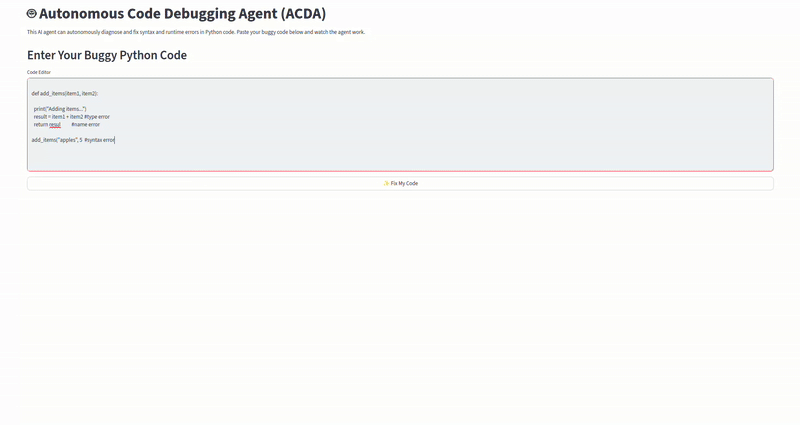

# Autonomous Code Debugging Agent (ACDA)

[](https://opensource.org/licenses/MIT)
[](https://www.python.org/downloads/)

**ACDA is an AI-powered agent that autonomously diagnoses, fixes, and validates corrections for syntax and runtime errors in Python code.**

---

### Live Demo

This project is deployed and publicly accessible. Interact with the live agent here:

**[➡️ Live App on Streamlit Community Cloud](https://your-app-name.streamlit.app)** *(<-- Update this link after you deploy!)*

<br>

 

---

### How It Works

ACDA operates on a continuous, autonomous loop that mimics a human developer's debugging process. The system is built with a modular architecture, ensuring each component is responsible for a single, well-defined task.

```mermaid
graph TD
    A[Start: Buggy Code] --> B{1. Execute Code};
    B -- Failure (Exit Code != 0) --> C{2. Parse Error};
    B -- Success (Exit Code == 0) --> H[End: Code Fixed];
    C --> D{3. Generate Solution (LLM)};
    D --> E{4. Apply Patch};
    E --> F{5. Validate Fix};
    F --> B;
```

<br>
