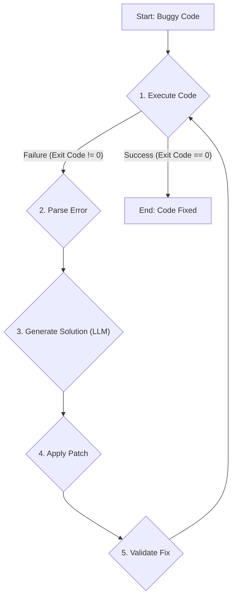

# Autonomous Code Debugging Agent (ACDA)

[](https://opensource.org/licenses/MIT)
[](https://www.python.org/downloads/)

**ACDA is an AI-powered agent that autonomously diagnoses, fixes, and validates corrections for syntax and runtime errors in Python code.**

---

### Live Demo

This project is deployed and publicly accessible. Interact with the live agent here:

<!---**[➡️ Live App on Streamlit Community Cloud](https://your-app-name.streamlit.app)** *(<-- Update this link after you deploy!)* --->

<br>

 

---

### How It Works

ACDA operates on a continuous, autonomous loop that mimics a human developer's debugging process. The system is built with a modular architecture, ensuring each component is responsible for a single, well-defined task.



<br>

---

-  **Secure Executor:** Runs the code inside a sandboxed **Docker container** to ensure safety and prevent the execution of malicious code on the host system.

-   **Error Parser:** If the code fails, it intelligently parses the `stderr` using regular expressions to extract structured data: the error type, line number, and message.

-   **Solution Generator:** It crafts a detailed prompt using the source code and parsed error, then queries the **Google Gemini API** to generate a proposed fix.

-   **Code Patcher:** Applies the LLM's corrected code to the file, first creating a backup of the original.

-   **Validation Loop:** The agent automatically re-runs the patched code. If it succeeds, the process is complete. If not, the loop repeats until the fix is validated or a maximum number of attempts is reached.

---

### Tech Stack

-   **Language:** Python 3.10

-   **AI/ML:** Google Gemini API (`google-generativeai`)

-   **Web Framework:** Streamlit

-   **Sandboxing & Containerization:** Docker

-   **Core Libraries:** `python-dotenv`, `subprocess`, `re`

---
#### How to Run Locally

Follow these steps to run the agent on your local machine.


#### 1\. Prerequisites

-   Python 3.10 or later

-   Docker Desktop or Docker Engine installed and running.

-   A Google AI API Key.

#### 2\. Installation

Clone the repository and install the required dependencies.

```bash
# Clone the repository
git clone https://github.com/The-Name-is-Karthik/Autonomous-Code-Debugging-Agent-ACDA-.git
cd Autonomous-Code-Debugging-Agent-ACDA-

# Create and activate a virtual environment
python -m venv venv
source venv/bin/activate  # On Windows: venv\Scripts\activate

# Install dependencies
pip install -r requirements.txt
```

#### 3\. Configuration

Create a `.env` file in the root directory and add your Google AI API key.

```
# .env
GOOGLE_API_KEY="YOUR_API_KEY_HERE"

```

#### 4\. Running the App

Launch the Streamlit web interface.

```
streamlit run app.py
```
